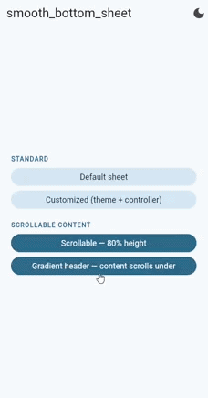

# smooth_bottom_sheet

[](https://pub.dev/packages/smooth_bottom_sheet)
[](https://pub.dev/packages/smooth_bottom_sheet)

Modern, animated and production-ready bottom sheets for Flutter apps.

Smooth motion, adaptive themes, and a clean API designed for real projects.

<p align="center">
  
  
</p>

Demo GIFs are included in `assets/readme` and show the base component and its behavior with long content.

## Why this package

Many bottom sheet implementations are either too basic or too tied to one app style.

`smooth_bottom_sheet` gives you:

- A production-ready visual baseline
- Strong customization without boilerplate
- A reusable architecture to keep UI, config and behavior clean

## Features

- Modern sheet container with adaptive light/dark theme defaults
- Smooth entrance animation (slide + fade) with configurable timing/curve
- Configurable layout (radius, padding, max width)
- Header API with title, subtitle, leading and trailing widgets
- Programmatic control via `SmoothBottomSheetController`
- `showSmoothBottomSheet(...)` helper for fast integration
- Works on mobile, tablet and desktop layouts

## Installation

```yaml
dependencies:
	smooth_bottom_sheet: ^0.0.1
```

## Quick usage

```dart
import 'package:flutter/material.dart';
import 'package:smooth_bottom_sheet/smooth_bottom_sheet.dart';

ElevatedButton(
	onPressed: () {
		showSmoothBottomSheet(
			context: context,
			title: 'Premium settings',
			subtitle: 'Control your experience',
			child: const Text('Your sheet content goes here'),
		);
	},
	child: const Text('Open sheet'),
)
```

## Customization

```dart
showSmoothBottomSheet(
	context: context,
	title: 'Custom sheet',
	theme: SmoothBottomSheetTheme.dark().copyWith(
		startColor: const Color(0xFF1E293B),
		endColor: const Color(0xFF0B1120),
	),
	layout: const SmoothBottomSheetLayout(
		borderRadius: 36,
		maxWidth: 640,
		contentPadding: EdgeInsets.fromLTRB(24, 0, 24, 24),
	),
	animation: const SmoothBottomSheetAnimation(
		duration: Duration(milliseconds: 420),
		beginOffset: Offset(0, 0.12),
	),
	child: const Text('Fully customized smooth sheet'),
)
```

## Example app

See `example/lib/main.dart` for a complete demo with:

- Default sheet
- Customized theme/layout
- Programmatic close using controller

## Author

Created by **Elia Zavatta**.

I build production-ready Flutter apps and reusable UI components.

- GitHub: [github.com/eliazv](https://github.com/eliazv)
- LinkedIn: [linkedin.com/in/eliazavatta](https://www.linkedin.com/in/eliazavatta/)
- Email: [info@eliazavatta.it](mailto:info@eliazavatta.it)

## Related smooth packages

- [smooth_charts](https://pub.dev/packages/smooth_charts)
- [smooth_infinite_tab_bar](https://pub.dev/packages/smooth_infinite_tab_bar)
- [smooth_paywall](https://pub.dev/packages/smooth_paywall)

## License

MIT
